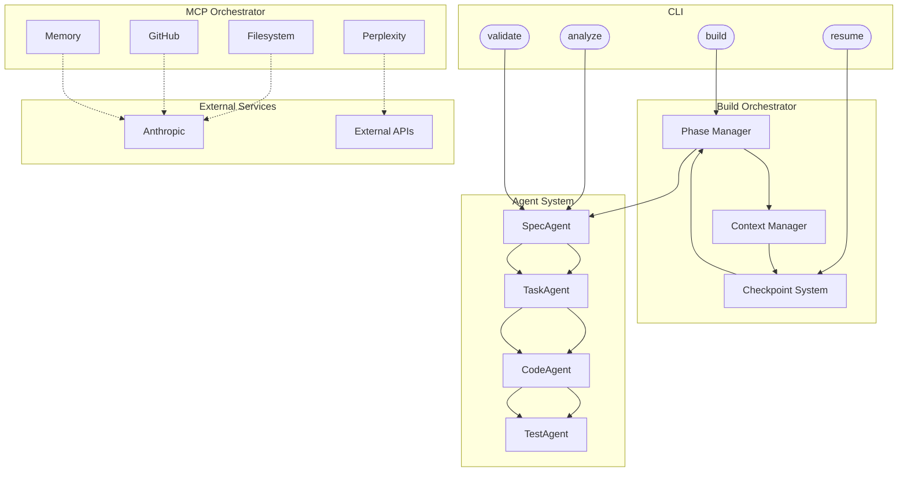

# Claude Code Builder

A revolutionary AI-powered Python CLI tool that automates the entire software development lifecycle using the Claude Code SDK. From specification to deployment, Claude Code Builder transforms product requirements into production-ready software with minimal human intervention.

## Overview

Claude Code Builder is an intelligent software generation system that:
- **Analyzes** natural language specifications to understand project requirements
- **Architects** optimal technical solutions using multi-agent collaboration
- **Builds** complete applications with proper structure, testing, and documentation
- **Manages** context intelligently to handle large specifications (150K+ tokens)
- **Orchestrates** specialized MCP servers for various development tasks
- **Resumes** builds from checkpoints, ensuring reliability and cost efficiency

## Table of Contents

- [Key Features](#key-features)
- [System Architecture](#system-architecture)
- [Installation](#installation)
- [Quick Start](#quick-start)
- [Usage](#usage)
- [Writing Specifications](#writing-specifications)
- [Configuration](#configuration)
- [API Reference](#api-reference)
- [Developer Guide](#developer-guide)
- [Advanced Features](#advanced-features)
- [Cost Management](#cost-management)
- [Troubleshooting](#troubleshooting)
- [Contributing](#contributing)

## Key Features

### 🤖 Multi-Agent Architecture
- **SpecAnalyzer**: Extracts requirements, identifies ambiguities, determines scope
- **TaskGenerator**: Creates comprehensive, ordered task lists with dependencies
- **InstructionBuilder**: Generates precise, Claude-compatible instructions
- **CodeGenerator**: Produces high-quality code following best practices
- **TestGenerator**: Creates comprehensive test suites
- **ReviewAgent**: Validates code quality and completeness

### 🔄 MCP Server Integration
- **Filesystem Server**: Secure file operations within project boundaries
- **GitHub Server**: Repository management and version control
- **Memory Server**: Persistent context across sessions
- **Fetch Server**: Web resource access for research
- **Perplexity Server**: Real-time information for technical decisions

### 💾 Advanced Context Management
- Handles specifications up to 150K tokens
- Intelligent chunking for optimal token usage
- Context compression without information loss
- Adaptive loading based on current phase needs

### 🔁 Checkpoint & Resume
- Automatic checkpointing after each phase
- Cost tracking and budget enforcement
- Seamless resume from any interruption
- Preserves all context and progress

### 🔌 Plugin System
- Extensible architecture for custom functionality
- Hook into any phase of the build process
- Create custom agents and MCP integrations
- Share and reuse plugins across projects

## System Architecture

The following Mermaid diagram illustrates how the CLI, orchestrator, agents, MCP
servers and external services interact:



## Installation

### Prerequisites
- Python 3.11 or higher
- Poetry (for dependency management)
- Node.js 18+ (for MCP servers)
- Git

### Detailed Installation Steps

1. **Clone the repository**
   ```bash
   git clone https://github.com/yourusername/claude-code-builder.git
   cd claude-code-builder
   ```

2. **Install Python dependencies**
   ```bash
   # Install Poetry if not already installed
   curl -sSL https://install.python-poetry.org | python3 -
   
   # Install project dependencies
   poetry install
   ```

3. **Install MCP servers**
   ```bash
   # Required MCP servers
   npm install -g @modelcontextprotocol/server-filesystem
   npm install -g @modelcontextprotocol/server-memory
   
   # Optional MCP servers
   npm install -g @modelcontextprotocol/server-github
   npm install -g @modelcontextprotocol/server-fetch
   npm install -g @modelcontextprotocol/server-perplexity
   ```

4. **Set up environment variables**
   ```bash
   # Create .env file
   cp .env.example .env
   
   # Add your API keys
   echo "ANTHROPIC_API_KEY=your-api-key" >> .env
   echo "GITHUB_TOKEN=your-github-token" >> .env  # Optional
   echo "PERPLEXITY_API_KEY=your-perplexity-key" >> .env  # Optional
   ```

5. **Verify installation**
   ```bash
   poetry run claude-code-builder --version
   poetry run claude-code-builder doctor  # Check system configuration
   ```

## Quick Start

### Your First Build

1. **Create a specification file** (`my-app-spec.md`):
   ```markdown
   # Todo List API
   
   ## Overview
   A simple REST API for managing todo items.
   
   ## Requirements
   - CRUD operations for todo items
   - SQLite database
   - Input validation
   - Unit tests
   
   ## Technology Stack
   - Python 3.11
   - FastAPI
   - SQLAlchemy
   - pytest
   ```

2. **Run the build**:
   ```bash
   poetry run claude-code-builder build my-app-spec.md --output ./todo-api
   ```

3. **Monitor progress**:
   The CLI will show real-time progress with Rich formatting, including:
   - Current phase and task
   - Token usage and costs
   - Estimated time remaining

4. **Review the output**:
   ```bash
   cd todo-api
   ls -la
   # Your complete application with tests and documentation!
   ```

## Usage

### Basic Commands

```bash
# Build from specification
claude-code-builder build <spec-file> [options]

# Analyze specification without building
claude-code-builder analyze <spec-file> [options]

# Resume a failed or interrupted build
claude-code-builder resume <project-dir> [options]

# Validate a specification
claude-code-builder validate <spec-file> [options]

# Initialize a new project
claude-code-builder init <project-name> [options]

# Show configuration
claude-code-builder config show

# Check system status
claude-code-builder doctor
```

### Build Options

```bash
claude-code-builder build spec.md \
  --output ./my-project \           # Output directory (default: auto-generated)
  --model claude-3-opus-20240229 \  # Model to use
  --max-cost 50.00 \                # Maximum build cost in USD
  --max-tokens 5000000 \            # Maximum tokens to use
  --phases "design,core,test" \     # Specific phases to run
  --continue-on-error \             # Continue even if a phase fails
  --dry-run \                       # Simulate without making changes
  --no-checkpoint \                 # Disable checkpointing
  --parallel \                      # Enable parallel agent execution
  --template advanced \             # Use advanced project template
  -vv                              # Verbose output
```

### Advanced Commands

```bash
# Analyze with cost estimation
claude-code-builder analyze spec.md --estimate-cost --detailed

# Validate and auto-fix issues
claude-code-builder validate spec.md --fix --output fixed-spec.md

# Resume from specific phase
claude-code-builder resume ./project --from-phase testing --reset-costs

# Generate specification template
claude-code-builder init my-project --template fullstack --output spec.md

# Export build metrics
claude-code-builder status ./project --export metrics.json

# List available plugins
claude-code-builder plugins list

# Run with specific plugin
claude-code-builder build spec.md --plugins "github-integration,docker-setup"
```

## Writing Specifications

### Basic Specification Template

```markdown
# Project Name

## Overview
Brief description of what the application does and its primary purpose.

## Objectives
1. Primary objective
2. Secondary objectives

## Requirements

### Functional Requirements
- User authentication
- Core feature 1
- Core feature 2

### Non-Functional Requirements
- Performance: < 200ms response time
- Security: OAuth2 authentication
- Scalability: 10K concurrent users

## Technology Stack
- Language: Python 3.11+
- Framework: FastAPI
- Database: PostgreSQL
- Testing: pytest

## Success Criteria
1. All tests passing
2. 90% code coverage
3. API documentation complete
```

### Advanced Specification Template

```markdown
# Enterprise Application Name

## Executive Summary
Comprehensive overview including business value and strategic alignment.

## Detailed Requirements

### User Stories
As a [user type], I want to [action] so that [benefit].

### API Specifications
```yaml
endpoints:
  - path: /api/v1/users
    method: POST
    request:
      type: object
      properties:
        email: string
        password: string
    response:
      type: object
      properties:
        id: string
        token: string
```

### Data Models
```python
class User:
    id: UUID
    email: str
    created_at: datetime
    profile: UserProfile
```

### Integration Requirements
- External API: PaymentProvider
- Authentication: Auth0
- Monitoring: DataDog

### Performance Requirements
- API Response: p95 < 100ms
- Database queries: < 50ms
- Concurrent users: 50K

### Security Requirements
- OWASP Top 10 compliance
- PCI DSS for payment handling
- GDPR compliance for EU users

### Deployment
- Container: Docker
- Orchestration: Kubernetes
- CI/CD: GitHub Actions

## Constraints
- Budget: $50K
- Timeline: 3 months
- Team: 2 developers

## Acceptance Criteria
1. All functional requirements implemented
2. Performance benchmarks met
3. Security audit passed
4. Documentation complete
```

### Best Practices for Specifications

1. **Be Specific**: Avoid vague requirements like "user-friendly UI"
2. **Include Examples**: Provide sample data, API calls, or UI mockups
3. **Define Success**: Clear, measurable acceptance criteria
4. **Specify Constraints**: Budget, timeline, technology limitations
5. **Prioritize Features**: Mark must-have vs nice-to-have features

## Configuration

### Project Configuration (`.claude-code-builder.json`)

```json
{
  "version": "0.1.0",
  "project_name": "My Project",
  "model": "claude-3-opus-20240229",
  "mcp_servers": {
    "filesystem": {
      "enabled": true,
      "allowed_directories": ["./src", "./tests"]
    },
    "github": {
      "enabled": true,
      "auto_commit": false,
      "branch": "feature/ai-generated"
    },
    "memory": {
      "enabled": true,
      "max_entities": 1000
    }
  },
  "build_config": {
    "max_cost": 100.0,
    "max_tokens": 10000000,
    "checkpoint_frequency": "phase",
    "parallel_agents": true,
    "continue_on_error": false
  },
  "phases": {
    "skip": ["deployment"],
    "custom_order": ["design", "core", "api", "test", "docs"]
  },
  "plugins": ["github-integration", "docker-setup"]
}
```

### Global Configuration (`~/.claude-code-builder/config.yaml`)

```yaml
api_key: ${ANTHROPIC_API_KEY}
default_model: claude-3-opus-20240229
mcp_servers:
  filesystem:
    command: npx
    args: ["-y", "@modelcontextprotocol/server-filesystem"]
  github:
    command: npx
    args: ["-y", "@modelcontextprotocol/server-github"]
    env:
      GITHUB_TOKEN: ${GITHUB_TOKEN}
  memory:
    command: npx
    args: ["-y", "@modelcontextprotocol/server-memory"]
defaults:
  max_cost: 100.0
  max_tokens: 10000000
  verbose: 1
  checkpoint_enabled: true
  parallel_agents: false
logging:
  level: INFO
  file: ~/.claude-code-builder/claude-code-builder.log
  max_size: 10MB
  backup_count: 5
```

## API Reference

### Core Classes

#### BaseAgent
Base class for all agents in the system.

```python
from claude_code_builder.agents import BaseAgent

class CustomAgent(BaseAgent):
    async def execute(self, context: ExecutionContext) -> AgentResponse:
        # Implementation
        pass
```

#### BuildOrchestrator
Manages the entire build process.

```python
from claude_code_builder.core import BuildOrchestrator

orchestrator = BuildOrchestrator(config)
await orchestrator.build(specification)
```

#### ExecutionContext
Provides context and utilities to agents.

```python
class ExecutionContext:
    project: Project
    mcp_clients: Dict[str, MCPClient]
    logger: Logger
    metrics: BuildMetrics
    checkpoint: CheckpointManager
```

### CLI Commands

All commands support `--help` for detailed information:

```bash
claude-code-builder build --help
claude-code-builder analyze --help
claude-code-builder resume --help
```

### Plugin System

Create custom plugins to extend functionality:

```python
from claude_code_builder.plugins import BasePlugin

class MyPlugin(BasePlugin):
    def on_phase_start(self, phase: str, context: ExecutionContext):
        print(f"Starting phase: {phase}")
    
    def on_phase_complete(self, phase: str, context: ExecutionContext):
        print(f"Completed phase: {phase}")
```

## Developer Guide

### Creating Custom Agents

1. **Define your agent**:
   ```python
   from claude_code_builder.agents import BaseAgent
   from claude_code_builder.core import AgentResponse, ExecutionContext
   
   class DatabaseMigrationAgent(BaseAgent):
       """Agent for handling database migrations."""
       
       async def execute(self, context: ExecutionContext) -> AgentResponse:
           # Access MCP clients
           filesystem = context.mcp_clients['filesystem']
           
           # Generate migration files
           migrations = await self.generate_migrations(context)
           
           # Write files
           for migration in migrations:
               await filesystem.write_file(
                   f"migrations/{migration.name}.py",
                   migration.content
               )
           
           return AgentResponse(
               success=True,
               summary="Generated database migrations",
               artifacts={"migrations": len(migrations)}
           )
   ```

2. **Register your agent**:
   ```python
   from claude_code_builder.agents import register_agent
   
   register_agent("database_migration", DatabaseMigrationAgent)
   ```

3. **Use in build configuration**:
   ```json
   {
     "phases": {
       "custom": {
         "database": {
           "agent": "database_migration",
           "config": {
             "migration_style": "alembic"
           }
         }
       }
     }
   }
   ```

### MCP Server Integration

Create custom MCP clients:

```python
from claude_code_builder.mcp import BaseMCPClient

class CustomMCPClient(BaseMCPClient):
    async def connect(self):
        # Connect to your MCP server
        pass
    
    async def custom_operation(self, data):
        # Implement custom operations
        pass
```

### Testing Your Extensions

```python
import pytest
from claude_code_builder.testing import AgentTestCase

class TestDatabaseMigrationAgent(AgentTestCase):
    async def test_migration_generation(self):
        context = self.create_test_context()
        agent = DatabaseMigrationAgent()
        
        response = await agent.execute(context)
        
        assert response.success
        assert response.artifacts["migrations"] > 0
```

## Advanced Features

### Specification Analysis

Get detailed analysis before building:

```bash
claude-code-builder analyze spec.md --detailed

# Output includes:
# - Complexity score
# - Estimated tokens
# - Estimated cost
# - Identified risks
# - Missing requirements
# - Suggested improvements
```

### Specification Validation

Validate and fix common issues:

```bash
# Validate only
claude-code-builder validate spec.md

# Validate and fix
claude-code-builder validate spec.md --fix

# Common fixes:
# - Missing required sections
# - Ambiguous requirements
# - Incomplete technology stack
# - Missing success criteria
```

### Template System

Use and create project templates:

```bash
# List available templates
claude-code-builder templates list

# Use a template
claude-code-builder init my-project --template microservice

# Create custom template
claude-code-builder templates create my-template --from ./existing-project
```

### Build Metrics and Analytics

Track and analyze build performance:

```bash
# View build metrics
claude-code-builder status ./project --metrics

# Export detailed analytics
claude-code-builder status ./project --export analytics.json

# Metrics include:
# - Token usage by phase
# - Cost breakdown
# - Time per phase
# - Error frequency
# - Agent performance
```

### Parallel Execution

Enable parallel agent execution for faster builds:

```bash
claude-code-builder build spec.md --parallel --max-workers 4
```

### Custom Build Phases

Define custom phases in your specification:

```yaml
phases:
  custom:
    data_pipeline:
      agent: "code_generator"
      dependencies: ["core"]
      config:
        templates: ["etl_pipeline.j2"]
    ml_training:
      agent: "ml_trainer"
      dependencies: ["data_pipeline"]
```

## Cost Management

### Understanding Costs

Claude Code Builder provides detailed cost tracking:

- **Token Costs**: Based on model pricing
- **Phase Breakdown**: Cost per build phase
- **Cumulative Tracking**: Total project cost
- **Budget Enforcement**: Stops when limit reached

### Cost Optimization Strategies

1. **Use Checkpoints**: Resume interrupted builds without re-running completed phases
2. **Phase Selection**: Run only necessary phases
3. **Model Selection**: Use smaller models for simpler tasks
4. **Context Optimization**: Enable aggressive context compression
5. **Specification Quality**: Clear specs reduce iteration

### Typical Project Costs

| Project Type | Complexity | Typical Cost | Token Usage |
|--------------|------------|--------------|-------------|
| CLI Tool | Simple | $5-15 | 50K-150K |
| REST API | Medium | $20-50 | 200K-500K |
| Full-Stack App | Complex | $50-150 | 500K-1.5M |
| Enterprise System | Very Complex | $150-500 | 1.5M-5M |

### Budget Management

```bash
# Set strict budget limit
claude-code-builder build spec.md --max-cost 25.00 --stop-on-limit

# Get cost estimate first
claude-code-builder analyze spec.md --estimate-cost

# Monitor costs in real-time
claude-code-builder build spec.md -vv  # Shows cost after each phase

# Resume with budget reset
claude-code-builder resume ./project --reset-costs --max-cost 50.00
```

## Troubleshooting

### Common Issues and Solutions

#### Build Fails with "Context too large"
**Problem**: Specification exceeds token limits
**Solutions**:
```bash
# Enable context optimization
claude-code-builder build spec.md --optimize-context

# Split into multiple files
claude-code-builder build main-spec.md \
  --include requirements.md \
  --include api-spec.md

# Use references instead of inline content
# In your spec:
# See API documentation: @file:api-docs.yaml
```

#### MCP Server Connection Failed
**Problem**: Cannot connect to MCP servers
**Solutions**:
```bash
# Check server installation
npm list -g | grep "@modelcontextprotocol"

# Test individual server
npx @modelcontextprotocol/server-filesystem --test

# Check permissions
claude-code-builder doctor --check-permissions

# View server logs
tail -f ~/.claude-code-builder/logs/mcp-*.log
```

#### Resume Not Working
**Problem**: Cannot resume from checkpoint
**Solutions**:
```bash
# Verify checkpoint integrity
claude-code-builder checkpoints verify ./project

# List available checkpoints
claude-code-builder checkpoints list ./project

# Resume from specific checkpoint
claude-code-builder resume ./project --checkpoint phase-3

# Force rebuild from phase
claude-code-builder resume ./project --from-phase core --force
```

#### High Token Usage
**Problem**: Build using more tokens than expected
**Solutions**:
```bash
# Analyze token usage
claude-code-builder analyze spec.md --token-breakdown

# Enable aggressive optimization
claude-code-builder build spec.md \
  --optimize-context \
  --compression-level high

# Exclude unnecessary phases
claude-code-builder build spec.md \
  --skip-phases "optimization,deployment"
```

#### Build Quality Issues
**Problem**: Generated code doesn't meet expectations
**Solutions**:
```bash
# Enable review phase
claude-code-builder build spec.md --enable-review

# Use stricter quality settings
claude-code-builder build spec.md \
  --quality high \
  --test-coverage 90

# Provide examples in specification
# Include code examples, API samples, UI mockups
```

### Debug Mode

Enable detailed debugging information:

```bash
# Maximum verbosity
claude-code-builder build spec.md -vvv

# Debug specific component
export CLAUDE_CODE_BUILDER_DEBUG=mcp,agents
claude-code-builder build spec.md

# Trace all API calls
export CLAUDE_CODE_BUILDER_TRACE=1
claude-code-builder build spec.md

# Save debug logs
claude-code-builder build spec.md \
  --debug \
  --log-file debug.log \
  --log-level DEBUG
```

### Performance Profiling

```bash
# Profile build performance
claude-code-builder build spec.md --profile

# Generate performance report
claude-code-builder status ./project --performance-report

# Identify bottlenecks
claude-code-builder analyze spec.md --bottlenecks
```

## Security Considerations

### API Key Management
- Never commit API keys to version control
- Use environment variables or secure key stores
- Rotate keys regularly
- Use separate keys for development/production

### File System Security
- MCP filesystem server runs with restricted permissions
- Only specified directories are accessible
- No access to system files or parent directories
- Automatic path sanitization

### Generated Code Security
- Code is scanned for common vulnerabilities
- Dependencies are checked against security databases
- Secrets are never hardcoded
- Security best practices are enforced

## Performance Optimization

### Async Operations
All operations are async by default for optimal performance:
- Parallel agent execution
- Concurrent MCP operations
- Non-blocking file I/O
- Efficient token streaming

### Context Optimization
- Intelligent context windowing
- Automatic summarization
- Relevant content extraction
- Token usage minimization

### Caching Strategy
- MCP response caching
- Template caching
- Partial build caching
- Dependency caching

## Contributing

We welcome contributions! Please follow these steps:

1. **Fork the repository**
2. **Create a feature branch**: `git checkout -b feature/amazing-feature`
3. **Make your changes**
4. **Run tests**: `poetry run pytest`
5. **Run linting**: `poetry run ruff check . && poetry run mypy .`
6. **Commit changes**: `git commit -m 'Add amazing feature'`
7. **Push to branch**: `git push origin feature/amazing-feature`
8. **Open a Pull Request**

### Development Setup

```bash
# Clone repository
git clone https://github.com/yourusername/claude-code-builder.git
cd claude-code-builder

# Install in development mode
poetry install --with dev

# Install pre-commit hooks
pre-commit install

# Run tests
poetry run pytest

# Run linting
poetry run ruff check .
poetry run mypy .

# Run formatter
poetry run black .

# Build documentation
poetry run mkdocs serve
```

### Code Style Guidelines

- Follow PEP 8 with 100 character line limit
- Use type hints for all functions
- Write descriptive docstrings
- Add unit tests for new features
- Update documentation

## License

MIT License - see [LICENSE](LICENSE) for details.

## Acknowledgments

- Built on [Claude Code SDK](https://github.com/anthropics/claude-code-sdk)
- Powered by [Model Context Protocol](https://modelcontextprotocol.io)
- Uses [Anthropic's Claude](https://www.anthropic.com) models
- UI components from [Rich](https://github.com/Textualize/rich)

## Support

- **Documentation**: [https://docs.claude-code-builder.ai](https://docs.claude-code-builder.ai)
- **Issues**: [GitHub Issues](https://github.com/yourusername/claude-code-builder/issues)
- **Discussions**: [GitHub Discussions](https://github.com/yourusername/claude-code-builder/discussions)
- **Discord**: [Join our Discord](https://discord.gg/claude-code-builder)
- **Email**: support@claude-code-builder.ai

---

**Claude Code Builder v0.1.0** - Built with ❤️ by the Claude Code Builder Team